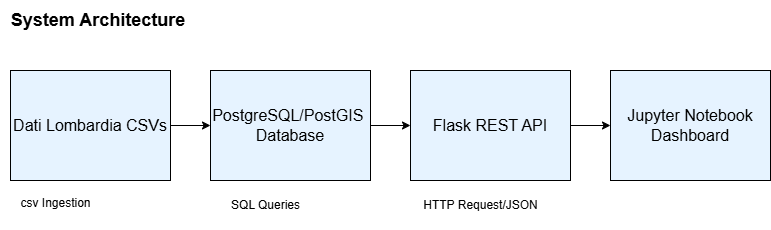
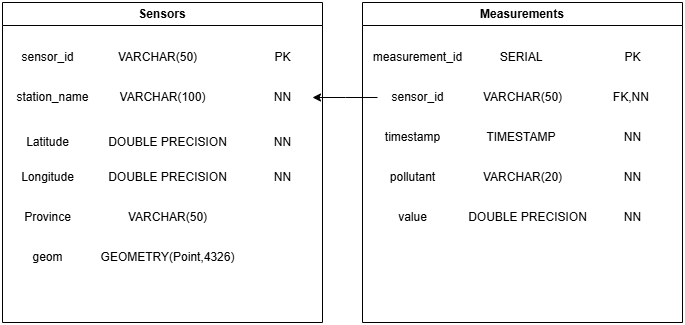
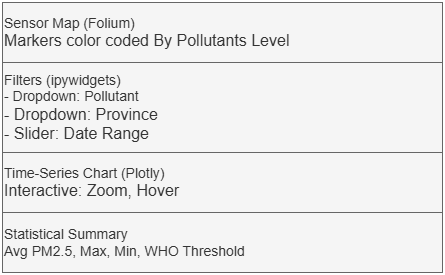

# Design Document (DD) - SE4GEO Project 2025

GeoGirls404 
 
Sadra Zahed Kachaee
Hoda Sadat Mousavi Tabar
Hananeh AsadiAghbolaghi 
Firoozeh Rahimian

---
## Table of Contents
- [1. Introduction](#1-introduction)
  - [1.1 Purpose](#11-purpose)
  - [1.2 Scope](#12-scope)
  - [1.3 Definitions and Acronyms](#13-definitions-and-acronyms)
  - [1.4 References](#14-references)
- [2. System Architecture](#2-system-architecture)
  - [2.1 Overview](#21-overview)
  - [2.2 Data Flow](#22-data-flow)
  - [2.3 Architecture Diagram](#23-architecture-diagram)
- [3. Database Design](#3-database-design)
  - [3.1 Overview](#31-overview)
  - [3.2 Schema](#32-schema)
  - [3.3 Indexes](#33-indexes)
  - [3.4 Data Ingestion](#34-data-ingestion)
  - [3.5 Entity-Relationship Diagram](#35-entity-relationship-diagram)
- [4. REST API Design](#4-rest-api-design)
  - [4.1 Overview](#41-overview)
  - [4.2 Endpoints](#42-endpoints)
  - [4.3 Implementation](#43-implementation)
  - [4.4 Security Considerations](#44-security-considerations)
- [5. Dashboard Design](#5-dashboard-design)
  - [5.1 Overview](#51-overview)
  - [5.2 Features](#52-features)
  - [5.3 Data Flow](#53-data-flow)
  - [5.4 Wireframe](#54-wireframe)
- [6. Implementation Considerations](#6-implementation-considerations)
  - [6.1 Tools and Technologies](#61-tools-and-technologies)
  - [6.2 Constraints](#62-constraints)
  - [6.3 Assumptions](#63-assumptions)
  - [6.4 Performance and Scalability](#64-performance-and-scalability)
- [7. Testing Strategy](#7-testing-strategy)
  - [7.1 Unit Testing](#71-unit-testing)
  - [7.2 Integration Testing](#72-integration-testing)
  - [7.3 User Testing](#73-user-testing)
- [8. Traceability Matrix](#8-traceability-matrix)
- [9. Conclusion](#9-conclusion)

The DD excludes:
- Detailed code implementations or code snippets.
- Installation and deployment instructions (reserved for the Software Release Document, SRD).
- User manuals or operational procedures.

## 1. Introduction

### 1.1 Purpose
This Design Document outlines the technical design of the SE4GEO air quality analysis system, a client-server application for querying and visualizing air quality data from Dati Lombardia. It translates the requirements from the Requirement Analysis and Specification Document (RASD) into a detailed plan for implementing a PostgreSQL/PostGIS database, a Flask-based REST API, and an interactive Jupyter Notebook dashboard. The DD serves as a blueprint for development, ensuring alignment with stakeholder needs, such as environmental agencies monitoring pollution trends in Lombardy.

### 1.2 Scope
The DD specifies the system architecture, database schema, REST API endpoints, and dashboard design for the SE4GEO application. It covers:
- Integration and storage of air quality measurements and sensor metadata.
- API endpoints for querying data by sensor, pollutant, and time period.
- Interactive visualizations, including maps and time-series charts.
- Technical choices and constraints for implementation.

Detailed code and installation instructions are deferred to the Software Release Document (SRD).

### 1.3 References
- Requirement Analysis and Specification Document (RASD), SE4GEO Project, 2025.
- Dati Lombardia Datasets:
  - Air Quality Measurements: [https://www.dati.lombardia.it/Ambiente/Datisensori-aria-dal-2018/g2hp-ar79/about_data](https://www.dati.lombardia.it/Ambiente/Datisensori-aria-dal-2018/g2hp-ar79/about_data)
  - Sensor Metadata: [https://www.dati.lombardia.it/Ambiente/Stazioni-qualit-dell-aria/ib47-atvt/about_data](https://www.dati.lombardia.it/Ambiente/Stazioni-qualit-dell-aria/ib47-atvt/about_data)
- Tools: PostgreSQL 17, PostGIS 3.4, Flask 3.x, Jupyter Notebook, Python 3.8+.
- Scrum Handbook (available on WeBeep).

---

## 2. System Architecture

### 2.1 Overview
The SE4GEO system follows a client-server architecture with a three-tier structure: data storage, application logic, and presentation. It comprises three main components:
- **Database**: PostgreSQL with PostGIS stores air quality measurements and sensor metadata, supporting relational and geospatial queries.
- **Web Server**: A Flask-based server hosts a REST API to query the database and return JSON data.
- **Dashboard**: A Jupyter Notebook client visualizes data through interactive maps, charts, and statistical summaries.

### 2.2 Data Flow
1. Dati Lombardia datasets (air quality measurements and sensor metadata) are processed and ingested into the PostgreSQL database.
2. The Flask REST API receives HTTP requests from the dashboard, queries the database, processes results (e.g., cleaning, aggregation), and returns JSON responses.
3. The Jupyter Notebook dashboard sends requests to the API, processes JSON data with `pandas`, and renders visualizations using `folium` and `plotly`.

### 2.3 Architecture Diagram


*The diagram illustrates the data flow from Dati Lombardia CSVs to the PostgreSQL/PostGIS database, through the Flask REST API, to the Jupyter Notebook dashboard.*

---

## 3. Database Design

### 3.1 Overview
The database is implemented in PostgreSQL 17 with PostGIS 3.4 to store and query air quality data from Dati Lombardia. It consists of two tables: `sensors` for sensor metadata and `measurements` for hourly pollutant measurements. PostGIS enables geospatial queries, such as identifying sensors within a province or radius.

### 3.2 Schema
- **Sensors Table**:
  - `sensor_id` (VARCHAR(50), Primary Key): Unique identifier (e.g., “123”).
  - `station_name` (VARCHAR(100), Not Null): Station name (e.g., “Milano - Via Senato”).
  - `latitude` (DOUBLE PRECISION, Not Null): Latitude coordinate (e.g., 45.4642).
  - `longitude` (DOUBLE PRECISION, Not Null): Longitude coordinate (e.g., 9.1895).
  - `province` (VARCHAR(50)): Administrative region (e.g., “MI” for Milan).
  - `geom` (GEOMETRY(Point, 4326)): PostGIS point for spatial queries, derived from latitude and longitude.
- **Measurements Table**:
  - `measurement_id` (SERIAL, Primary Key): Auto-incrementing ID.
  - `sensor_id` (VARCHAR(50), Foreign Key): References `sensors(sensor_id)`.
  - `timestamp` (TIMESTAMP, Not Null): Measurement time (e.g., “2023-01-01 00:00:00”).
  - `pollutant` (VARCHAR(20), Not Null): Pollutant type (e.g., “PM2.5”, “NO2”).
  - `value` (DOUBLE PRECISION, Not Null): Measured value in μg/m³ (e.g., 25.3).

### 3.3 Indexes
- `measurements`: Indexes on `sensor_id` and `timestamp` for efficient filtering by sensor and date range.
- `sensors`: GIST index on `geom` for spatial queries (e.g., `ST_DWithin` for proximity searches).

### 3.4 Data Ingestion
Data is ingested from `combined_air_quality_data.csv`, created by merging Dati Lombardia’s air quality and sensor datasets. A Python script (`db/load_data.py`) uses `psycopg2` to populate the tables, handling duplicates and missing values. The script first loads unique sensors into the `sensors` table, then inserts measurements into the `measurements` table, ensuring foreign key constraints are met.

### 3.5 Entity-Relationship Diagram


*The ERD shows the `sensors` and `measurements` tables, with a foreign key relationship from `measurements.sensor_id` to `sensors.sensor_id`.*

---

## 4. REST API Design

### 4.1 Overview
The REST API, built with Flask 3.x, exposes endpoints to query the PostgreSQL database and return cleaned, JSON-formatted data. It serves as the interface between the database and the Jupyter Notebook dashboard, supporting queries for sensor metadata, measurements, and aggregated statistics.

### 4.2 Endpoints
- **GET /sensors**:
  - **Description**: Returns metadata for all sensors.
  - **Parameters**: None.
  - **Response**: JSON array of sensor objects.
  - **Example**:
    ```json
    [
      {
        "sensor_id": "123",
        "station_name": "Milano - Via Senato",
        "latitude": 45.4642,
        "longitude": 9.1895,
        "province": "MI"
      }
    ]
    ```
- **GET /measurements**:
  - **Description**: Retrieves measurements with optional filters.
  - **Parameters** (query string):
    - `sensor_id` (string, optional): Filter by sensor (e.g., “123”).
    - `pollutant` (string, optional): Filter by pollutant (e.g., “PM2.5”).
    - `start_date` (string, optional): Start date (e.g., “2023-01-01”).
    - `end_date` (string, optional): End date (e.g., “2023-01-31”).
  - **Response**: JSON array of measurement objects.
  - **Example**:
    ```json
    [
      {
        "sensor_id": "123",
        "timestamp": "2023-01-01T00:00:00",
        "pollutant": "PM2.5",
        "value": 25.3
      }
    ]
    ```
- **GET /stats**:
  - **Description**: Returns aggregated statistics (e.g., average pollutant levels by province).
  - **Parameters** (query string):
    - `pollutant` (string, required): Pollutant to aggregate (e.g., “NO2”).
    - `province` (string, optional): Filter by province (e.g., “MI”).
  - **Response**: JSON object with statistics.
  - **Example**:
    ```json
    {
      "province": "MI",
      "pollutant": "PM2.5",
      "average_value": 22.5,
      "max_value": 40.3,
      "min_value": 10.2
    }
    ```

### 4.3 Implementation
- The API uses `psycopg2` to execute SQL queries against the PostgreSQL database.
- Data preprocessing ensures quality (e.g., removing negative values, handling nulls).
- Endpoints are implemented in `backend/app.py`, with routes defined using Flask’s `@app.route` decorator.

### 4.4 Security Considerations
- Basic input validation prevents SQL injection (e.g., sanitizing `sensor_id`).
- Optional: API key authentication (if time permits).

---

## 5. Dashboard Design

### 5.1 Overview
The dashboard, implemented in a Jupyter Notebook (`dashboard/dashboard.ipynb`), provides an interactive interface for visualizing air quality data. It uses `folium` for maps, `plotly` for charts, and `ipywidgets` for user inputs, enabling stakeholders to explore pollution trends and risks.

### 5.2 Features
- **Interactive Map**:
  - Displays sensor locations on a map of Lombardy using `folium`.
  - Markers are color-coded based on the latest pollutant levels (e.g., red for PM2.5 > 25 μg/m³).
- **Time-Series Charts**:
  - Plots pollutant levels over time for selected sensors or provinces using `plotly`.
  - Supports zooming and hovering for details.
- **Statistical Summaries**:
  - Shows metrics like average, max, and min pollutant levels.
  - Highlights exceedances of WHO thresholds (e.g., PM2.5 > 15 μg/m³ daily average).
- **Filters**:
  - `ipywidgets` dropdowns and sliders for selecting pollutant, sensor, province, or date range.
- **Custom Views**:
  - Option to export charts as PNG or data as CSV.

### 5.3 Data Flow
- The dashboard uses the `requests` library to query the Flask API (e.g., `GET /measurements?sensor_id=123&pollutant=PM2.5`).
- JSON responses are processed with `pandas` for analysis and visualization.

### 5.4 Wireframe


*The wireframe shows a map at the top, filter widgets on the side, a time-series chart below, and a statistical summary at the bottom.*

---

## 6. Implementation Considerations

### 6.1 Tools and Technologies
- **Database**: PostgreSQL 17, PostGIS 3.4.
- **Web Server**: Flask 3.x.
- **Dashboard**: Jupyter Notebook with Python 3.8+, `pandas`, `plotly`, `folium`, `ipywidgets`.
- **Development**: VSCode with Git for version control.

### 6.2 Constraints
- Limited to Dati Lombardia datasets (no external data unless optional).
- Static data ingestion (continuous ingestion is optional due to time constraints).
- Project deadline: July 4, 2025, limits scope of advanced features.

### 6.3 Assumptions
- Dati Lombardia datasets have consistent `sensor_id` values across air quality and sensor metadata.
- Users have basic technical skills to run Jupyter Notebooks locally.
- Hardware supports PostgreSQL and Flask (e.g., 8GB RAM, 2-core CPU).

### 6.4 Performance and Scalability
- Database indexes ensure queries return within 2 seconds for 1 year of data.
- API supports up to 10 concurrent users.
- Dashboard visualizations load within 5 seconds for typical datasets.

---

## 7. Testing Strategy

### 7.1 Unit Testing
- Test Flask API endpoints with `pytest` (e.g., verify `/sensors` returns valid JSON).
- Test database queries for accuracy (e.g., correct filtering by `pollutant`).

### 7.2 Integration Testing
- Verify API-to-database connectivity (e.g., `/measurements` retrieves correct data).
- Test dashboard-to-API interaction (e.g., map displays all sensors).

### 7.3 User Testing
- Group members simulate environmental officer workflows to validate dashboard usability.
- Check visualization accuracy (e.g., PM2.5 trends match raw data).

---
## 8. Traceability Matrix

The following matrix ensures that each user story identified in the RASD is properly addressed by at least one design element within the system architecture, database, API, or dashboard.

| **User Story ID** | **Role**       | **User Story (Summary)**                                                             | **Design Element**                                                                 |
|------------------|----------------|--------------------------------------------------------------------------------------|-------------------------------------------------------------------------------------|
| US01             | Developer      | Ingest air quality and sensor data                                                  | 3.4 Data Ingestion, 3.1 Overview                                                   |
| US02             | Developer      | Configure DB schema with spatial/time support                                       | 3.2 Schema, 3.3 Indexes                                                            |
| US03             | Public User    | Query data by time/location                                                         | 4.2 GET /measurements, 5.2 Features                                                |
| US04             | Public User    | View pollutant levels on maps and charts                                            | 5.2 Interactive Map, Time-Series Charts                                            |
| US05             | Public User    | Filter data by pollutant/date                                                       | 5.2 Filters, 5.3 Data Flow                                                         |
| US06             | Public User    | Export data                                                                          | 5.2 Custom Views, Export CSV option                                                |
| US07             | Analyst        | Generate statistical reports                                                        | 4.2 GET /stats, 5.2 Statistical Summaries                                          |
| US08             | Analyst        | Perform spatial queries (e.g., within a province)                                   | 3.3 GIST Index, 5.2 Map Interaction, 3.1 PostGIS support                           |
| US09             | Analyst        | Export time-series data                                                             | 5.2 Time-Series Charts + Export, 5.3 JSON via API                                  |

---

## 9. Conclusion
This Design Document provides a comprehensive plan for implementing the SE4GEO air quality analysis system. The PostgreSQL/PostGIS database efficiently stores and queries data, the Flask REST API enables flexible data retrieval, and the Jupyter Notebook dashboard delivers intuitive visualizations. The design aligns with the RASD requirements, ensuring stakeholders can monitor pollution trends and assess public health risks in Lombardy.

---
