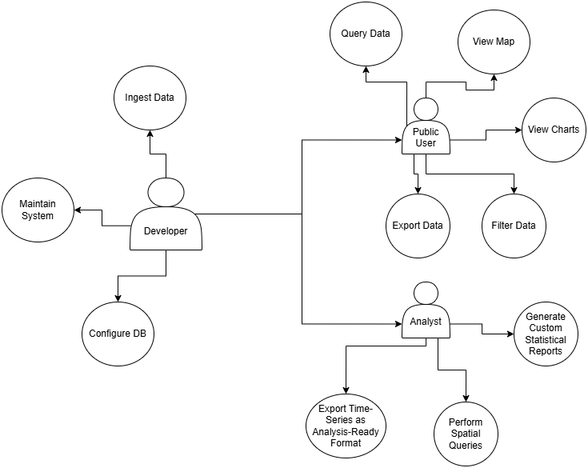

# 🧾 Requirement Analysis and Specification Document (RASD)

## 1. Introduction

### 1.1 Purpose
This document defines the requirements for a web-based client-server system for analyzing and visualizing air quality data from *Dati Lombardia*.

### 1.2 Scope
The system ingests, stores, queries, and visualizes air quality measurements. It supports analysts and public users with a REST API and an interactive dashboard built in Jupyter Notebooks.

### 1.3 Intended Audience
- Developers and system maintainers
- Analysts performing air quality assessments
- Public users interested in pollution trends
- Instructors evaluating the course project

---

## 2. Overall Description

### 2.1 Product Perspective
The system will be a client-server application designed to support the analysis and visualization of air quality data. It will consist of:
- A backend responsible for managing data ingestion, storage, and query processing.
- A user interface for interacting with the data through visual exploration and filtering.

The product will operate on publicly available air quality data collected from official monitoring stations, enabling users to gain insight into pollution levels and trends.

### 2.2 User Characteristics
The system is intended for a range of users with varying technical backgrounds:
- **Developers** who will be responsible for setting up and maintaining the system.
- **Analysts** who require advanced data analysis capabilities such as querying by custom filters or conducting trend studies.
- **Public Users** who seek to explore pollution levels in an intuitive, visual way, without requiring in-depth technical knowledge.

### 2.3 Constraints
- The system will rely on the availability and format consistency of official public datasets.
- It must ensure responsiveness and usability across typical modern computing environments (e.g., laptops, desktops).
- It should function with a moderate internet connection and local compute power.

### 2.4 Assumptions and Dependencies
- The source data will remain accessible via open government portals.
- The target users will have access to a web browser or compatible platform to interact with the interface.
- The project will be developed and maintained by a small team of students following a structured methodology.

---

## 3. Specific Requirements

### 3.1 Functional Requirements

User stories are listed below in tabular format:

| ID    | Role         | User Story                                                                                     | Priority |
|-------|--------------|-----------------------------------------------------------------------------------------------|----------|
| US01  | Developer     | As a developer, I want to ingest air quality and sensor data, so I can store it in a database. | High     |
| US02  | Developer     | As a developer, I want to configure the database schema, so it supports spatial/time queries. | High     |
| US03  | Public User   | As a public user, I want to query data by time/location, so I can view air quality information.| High     |
| US04  | Public User   | As a public user, I want to view pollutant levels on a map and in charts.                    | High     |
| US05  | Public User   | As a public user, I want to filter data by pollutant or date, so I can customize my view.     | Medium   |
| US06  | Public User   | As a public user, I want to export data, so I can save it for later use.                      | Medium   |
| US07  | Analyst       | As an analyst, I want to generate statistical reports, so I can interpret pollution trends.   | High     |
| US08  | Analyst       | As an analyst, I want to perform spatial queries, so I can study pollution within custom areas.| High     |
| US09  | Analyst       | As an analyst, I want to export time-series data in a clean format, so I can analyze it offline.| High     |

---

### 3.2 Non-Functional Requirements

| ID     | Requirement                                                                      |
|--------|----------------------------------------------------------------------------------|
| NFR01  | API queries must return responses in < 2 seconds for common queries              |
| NFR02  | Database must support indexing for spatial and temporal filtering                |
| NFR03  | Data must be returned in a valid, structured JSON schema                         |
| NFR04  | Jupyter dashboard must provide responsive, user-friendly visualizations          |
| NFR05  | The entire system must be version-controlled with GitHub                         |

---

## 4. Use Case Model

### 4.1 Actors
- **Developer**
- **Public User**
- **Analyst**

## 4.2 Use Case Diagram

---

## 5. External Interfaces

| Interface       | Description                                                                 |
|------------------|-----------------------------------------------------------------------------|
| Data Source     | Air quality and sensor datasets from Dati Lombardia                         |
| REST API        | Flask-based endpoints for filtering and retrieving air quality data         |
| Database        | PostgreSQL with PostGIS for spatial queries and efficient storage           |
| Dashboard       | Jupyter Notebook interface with interactive charts and maps                 |

---
## 7. Conclusion

This document has outlined the functional and non-functional requirements of the air quality analysis system, along with a clear description of its users, features, and overall goals. By defining the use cases and expected behaviors from the perspective of developers, analysts, and public users, this RASD establishes a shared understanding for the design and implementation phases that follow.

The next step will be to translate these requirements into a system design, focusing on the architectural structure, data models, and interaction flows necessary to meet the outlined expectations. The team will ensure that development adheres to the specified requirements, maintaining usability, performance, and scalability throughout the project lifecycle.

This RASD serves as a foundation for both current development and future enhancements, ensuring the system remains robust, user-oriented, and aligned with its intended purpose.

